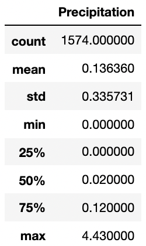
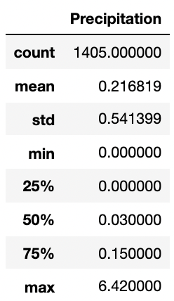

# Climate Analysis 

## Overview of the Analysis 

I analyze the weather of Oahu for the months of June and December from a given SQLite database file by an investor. In Jupiter notebook using SQLAlchemy, I analyze the data. This analysis is divided into two parts; in the first part, I provide summary statistics for the months of June and December, in the second part delve further into the data to provide additional queries and a much comprehensive data analysis. In the results section of my analysis folder, I underscore three major points from my analysis. Furthermore, I continue my analysis by concluding in the summary section the results of the additional queries I generated.
### Objective of the Analysis 

The main purpose of this analysis is to conduct a weather analysis to decide whether opening a Surf shop and an ice cream shop in Oahu is profitable and sustainable. Many businesses don't consider a depth analysis of the market, and rather tend to believe in their instincts and what people say. It is crucially important to lay down a comprehensive analysis of the market and its potentials before agreeing to enter it. 

### About Oahu 

Oahu is a US state, it is one of the many Hawaiian Islands located in the Pacific Ocean. The island is known for its two seasons: winter from November to April and summer from May to October. Oahu is a destination in winter for advanced surfers to take the opportunity of the large and strong waves.
## Results 

1. The mean temperature for June in Oahu is 74.94 Fahrenheit. The lowest and highest temperatures the month of June saw were 64 and 85 Fahrenheit, respectively. I can say that Oahu has warm weather for June. Oahu can be a good opportunity for less advanced surfers during the summer session. I believe the ice creams in the shop will be selling out.

	

	**Table 1: Temperatue Summary Statistics for the Months of June** 
	
1. The mean temperature for December in Oahu is 71.0. The lowest and highest temperatures the month of December saw were 56 and 83 Fahrenheit, respectively. Compared to June, December is slightly cooler. Since December is classified as the winter season in Oahu, advanced surfers can enjoy the waves. Although compared to June the ice cream shop may not have high sales, the business may still be profitable considering the weather doesn't differ that much.

	
		
	**Table 2: Temperatue Summary Statistics for the Months of December** 

	
1. Considering only the temperatures for June and December is not a justifiable indicator to assess whether to open a surf shop in Oahu. I believe many other factors can be taken into consideration, including, but not limited to the number of competitors on the island, whether the island attracts a lot of surfers annually, and a more in-depth analysis of the weather like wind speed, humidity, and precipitation.

## Summary 

The results only give a glimpse of what the surf shop and the ice cream shop will experience in Oahu. However, we can conclude by only looking at the temperature that Oahu can be a likable location for surfers to come and enjoy the weather, the waves, and the ice creams. I concluded the analysis by retrieving the precipitation rates for the months June and December. 

1. The mean precipitation rate for June is 0.136 with 75% of the precipitation equalling 0.12, meaning moderate rainfall.

	
	
	**Table 3: Precipitation Summary Statistics for the Months of June** 
	

1. The mean precipitation rate for December is 0.22 with 75% of the precipitation equalling 0.15, meaning moderate rainfall. But compared to June, the rainfall rate is higher. 

	
	
	**Table 4: Precipitation Summary Statistics for the Months of December** 

Both precipitation results for June and December can help in deciding whether it is profitable and sustainable to open a surf and ice cream shop in Oahu. Taking other indicators into account, as stated in the third bulletin of the results section, as well as the results in this analysis will make the decision to invest in such a project profitable and sustainable.