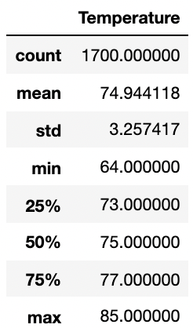
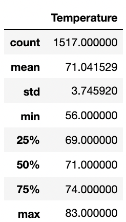

# Climate Analysis 

## Overview of the Analysis 

I analyze the weather of Oahu for the months of June and December from a given SQLite database file by an investor. In jupyter notebook using SQLAlchemy I analyze the data. This analysis is diveded into two parts; in the first part I provide a summary statistics for the months of June and December, in the second part delve further into the data to provide additional queries and a much comprehensive data analysis. In the results section of my analysis folder I underscore three major points from my analysis. Furthermore, I continue my analysis by concluding in the summary section the results of the additional queries I generated. 
### Objective of the Analysis 

The main purpose of this analysis is to conduct a weather analysis in order to decide wheather opening a Surf shop in Oahu is profitable. Many businesses don't consider in depth analysis' of the market, and rather like to believe in their instincts and what people say. It is crucially important to lay down a comprehensive analysis of the market and its potentials before agreeing to enter it. 

### About Oahu 

Oahu is a US state, it is one of the many Hawaiian Islands located in the Pacific Ocean. The island is know for its two seasons: winter from November to April and summer from May to October. Oahu, is a destination in winter for advanced surfers to take opportunity of the large and strong waves. 

## Results 
Considering only the temperatures for the months of June and December is not a justifiable indicator to assess whether to open a surf shop in Oahu. I believe there are many other factors that can be taken into consideration, including, but not limited to the number of competitors on the island, whether the island attracts a lot of surfers annually, and a more in depth analysis of the weather like: wind speed, humidity and percipitation. 

1. The mean temperature for the months of June in Oahu is 74.94 Fahrenheit. The lowest and higest tempratures the month of June saw was 64 and 85 Fahrenheit, respectively. I can say that Oahu has a lukewarm weather for the month of June. Oahu can be a good opportunity for less advanced surfers during the summer session.

	

	**Table 1: Temperatue Summary Statistics for the Months of June** 
	
1. The mean temperature for the months of December in Oahu is 71.0. The lowest and higest tempratures the month of December saw was 56 and 83 Fahrenheit, respectively. Compared to the month of June, December is slightly cooler. Since December is classified as the winter season in Oahu, advnaced surfers can enjoy the s.  

	
		
	**Table 2: Temperatue Summary Statistics for the Months of December** 

	
1. SQLAlchemy is a promising tool to communicate betwee 